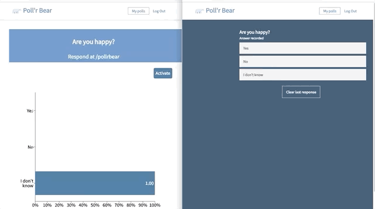
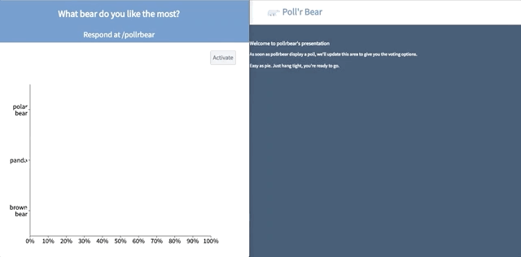

# PollrBear

PollrBear is a live polling web application inspired by Poll Everywhere built on ReactJS and Ruby on Rails with PostgreSQL database.

[PollrBear live][heroku]

[heroku]: https://pollr-bear.herokuapp.com/

## List of Features
- Live update poll-view that updates as users respond
- Create and edit multiple-choice questions
- Ability to group questions into descriptive groups
- Activate and deactivate questions to be taken
- Live update active question for users to respond
- Full-user authentication

### Groups

Groups act as organizational containers that the user can use to store related questions. On login, an AJAX request is made to the database that fetches a user's groups. Since there is an association between groups and questions, that single AJAX call also passes in the questions that each group contains.

The user also has a permanent container named 'Ungrouped'. Similar to PollEverywhere, an attempt to delete this group will cause all of the questions within itself to be deleted, but the 'Ungrouped' container will remain. This is due to conditional logic in the backend.

### Graph Rendering & Live Results

The presenter can receive live visual results through implementation of WebSockets. Utilizing Pusher, when an audience member responds to a poll, an action to update the live-view graph is triggered. The bar graph is rendered through utilizing the Recharts library.

### Active Polling & Responses

Presenters have the ability to set which poll is active to the audience in real time through a single URL (https://pollr-bear.herokuapp.com/#/:username), again using WebSockets. Due to Pusher implementation, the audience does not have to refresh the page, or visit a new URL when the presenter changes the active question. If a poll is not active, the audience cannot respond. If no poll is active, the audience is prompted to wait until a poll is active.

### Endless Choices

New question components have two choices by default. When creating a new poll, users can create more choices. Upon clicking the pencil icon, users can create endless choices or edit the question and how many existed choices on the single edit form.

## Future Implementation Ideas

To improve upon this project - the future direction of this project would involve the implementation of:

### Search functionality

Giving the presenter the ability to search for questions within their index page would boost functionality, especially when time cannot be wasted searching for a question. This would be completed through implementing a search filter.

### More question choices

Keeping true to PollEverywhere, more question types would allow for more interactivity between presenter and audience. Some ideas involve Q & A, Open Ended, or Word Cloud.